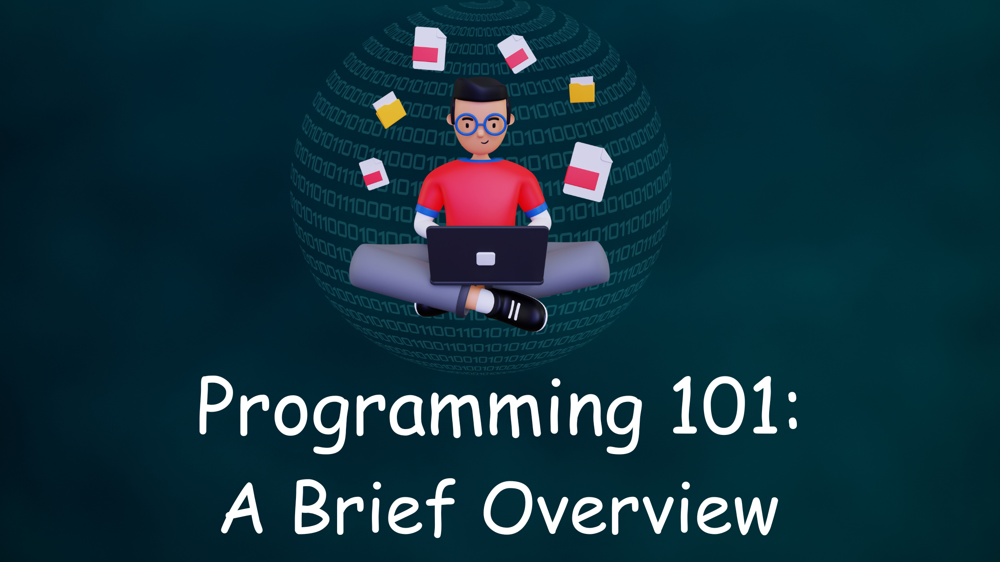
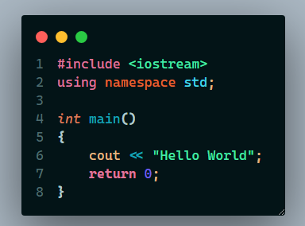
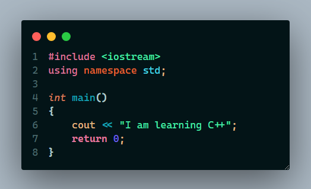
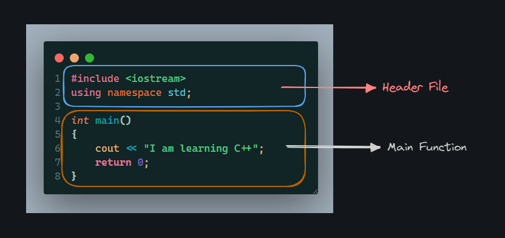

# C++ Fundamentals: Building a Strong Foundation


---

In this blog series, we will cover the essential building blocks of C++ programming, making it accessible for beginners and those looking to reinforce their core knowledge. We'll cover topics such as the basics of C++ syntax and data types, how to create and use functions, the importance of variables and memory management, and understanding control structures like loops and conditionals.

By the end of this series, you'll have a strong foundation in C++, setting the stage for your journey into more advanced aspects of this powerful programming language. So let's get started

---
### Programming 101: A Brief Overview

Before learning C++ or any other programming language, one should know what programming actually is. Let's understand it in a practical and relatable way




**Programming is like making coffee: it's a process of following a recipe to create something delicious.**

In both cases, you start with the right ingredients (code or coffee beans and water). Then, you follow a set of steps to create the desired output (a working program or a delicious cup of coffee). If something goes wrong, you need to debug the process (fix the code or adjust the coffee brewing).

And just like with coffee, there are many different ways to approach programming. You can use different tools, languages, and frameworks to create the same program. And you can customize your approach to suit your own style and preferences.

Here's a fun analogy:

**Imagine that you're a programming barista. Your job is to create custom coffee drinks for your customers.**

Each customer has their own unique preferences, so you need to be able to adapt your recipes accordingly. You also need to be able to troubleshoot problems if something goes wrong.

For example, if a customer orders a latte but their coffee is too weak, you know that you need to use more coffee grounds. Or, if a customer's espresso is too bitter, you know that you need to use less coffee grounds or grind the beans more coarsely.

In the same way, programmers need to be able to adapt their code to solve different problems and troubleshoot errors.

Let us understand it in another way also, **Programming is like giving instructions to a robot.**

You tell the robot what to do, step by step, and it follows your instructions. If you give the robot clear and concise instructions, it will be able to complete the task without any problems. But if your instructions are unclear or incomplete, the robot will get confused and may not be able to complete the task.

Programming is similar. You write instructions for a computer to follow, and the computer follows your instructions to complete a task. If your instructions are clear and concise, the computer will be able to complete the task without any problems. But if your instructions are unclear or incomplete, the computer will get confused and may not be able to complete the task.

Here is a simple example:

```
Tell the robot to go to the kitchen and make a cup of coffee.
```

The robot would need to know the following steps to complete this task:

1. Walk to the kitchen.
2. Open the kitchen cabinet and get a coffee cup.
3. Walk to the sink and fill the coffee cup with water.
4. Walk to the coffee maker and add coffee grounds to the filter.
5. Place the coffee cup under the filter basket.
6. Turn on the coffee maker.
7. Wait for the coffee to brew.
8. Turn off the coffee maker.
9. Bring the cup of coffee back to the living room.

If you gave the robot the following instructions:

```
Go to the kitchen and make a cup of coffee.
```

The robot would not know what steps to take to complete this task. It would need more specific instructions, such as the steps listed above.

---

### Exploring C++: Its Language and Origins

C++ is a programming language that is like a powerful toolbox for building software.

Imagine that you are a carpenter. You have a toolbox full of tools that you can use to build different things, such as tables, chairs, and houses. C++ is like a toolbox for programmers. It has a variety of tools that you can use to build different types of software, such as operating systems, games, and web applications.

Some of the tools in C++ toolbox include:

- **Data types:** These are used to store different types of information, such as numbers, strings, floats and Boolean values.
- **Control flow:** These are used to control the flow of execution of your program.
- **Functions:** These are reusable blocks of code that can be used to perform specific tasks.
- **Classes and objects:** These are used to create reusable code modules that can be used to model real-world objects and their interactions.

Don't worry, you don't have to understand them right now. We will go through them in an easy order and way to understand each concept.

>You can imagine that C++ is a magic wand. With C++, you can create anything you can imagine, from simple programs to complex applications.
>
>Just like a magic wand, C++ is a powerful tool, but it can also be dangerous if used incorrectly. It is important to learn how to use C++ safely and responsibly.

Before getting to know this magic wand, lets get to know how it was born.

C++ was born in 1979, when Bjarne Stroustrup first started developing it. C++ was a small and simple language at first, but it grew and matured over time.

In 1983, C++ was officially named and released to the public. This was like C++ graduating from kindergarten and starting elementary school. In the years that followed, C++ continued to grow and learn. New features were added, and the language became more powerful and versatile.

In 1998, C++ reached middle school. This was the release of C++2, which added new features such as templates and exception handling. C++ continued to grow and mature in high school. New features were added, and the language became more standardized.

In 2003, C++ graduated from high school and entered college. This was the release of C++3, which added new features such as namespaces and type safety.

C++ continues to grow and learn in college. New features are added, and the language becomes more sophisticated.

In 2011, C++ reached adulthood. This was the release of C++11, which added major new features such as move semantics, lambda expressions, and smart pointers.

C++ continues to evolve today, as new features are added and the language becomes more powerful and versatile.

---


### Writing Your First C++ Program: Hello World

Okay, Lets write some code with our magic wand C++ and do some magic and understand how does this magic work.




This is the basic simple Hello World program written in C++ where the program will just display us "Hello World" . But how does this code actually works.

From what we are seeing in this code, we see that there is something in 

```c++
cout << "Hello World";
```

and we are seeing `Hello World` in the output. That means whatever we write in those quotation marks in the exact same code structure, the program will give us an output of those words. Lets try out with a different text and see if it prints. 



>Output

```bash
I am learning C++
```

Here we can see that yes whatever we are writing inside those double quotations, it is getting displayed in the terminal. You can try it out displaying your own name in the terminal.

so if we break this program, we can see this 

where we can divide the whole program into two parts
1. Header File
2. Main Function

In the Header file area we mainly declare that which C++ files we will be using to run our programs. In this particular example we are using `iostream` header file. To use a header file we need to write `#include<header-file-name>` because only then the C++ compiler will understand that we want to use this header file in our program. 

Second part is the Main Function area where we will be doing most of our works. The `main()` function in C++ is like the starting gate at a race. It is the first function that is executed when a C++ program is run. The `main()` function in C++ is like the starting gate for your program. When the program starts, the `main()` function is executed. The `main()` function then tells your program what to do.

Another way of understanding the `main()` function is that imagine you are a chef and you are cooking a meal. The `main()` function is like the recipe for your meal. It tells you what ingredients to use and how to combine them.

If you follow the recipe correctly, you will end up with a delicious meal. But if you make a mistake in the recipe, you may end up with a disaster.

The same is true for the `main()` function in C++. If you write the `main()` function correctly, your program will work as expected. But if you make a mistake in the `main()` function, your program may not work at all. 

Now if we look inside the `main()` function we can see that the first line is:
```c++
cout << "I am learning C++";
```

where `I am learning C++` gets displayed on the terminal/console. The `cout` is a short form of "console output". It is a predefined object in the `std` namespace that is used to print output to the console.  

And the `return 0` statement in the end of the `main()` function in C++ tells the operating system that the program has terminated successfully. 

The operating system uses the return value from the `main()` function to determine how to exit the program. If the return value is 0, the operating system knows that the program terminated successfully. Otherwise, the operating system knows that the program terminated with an error.