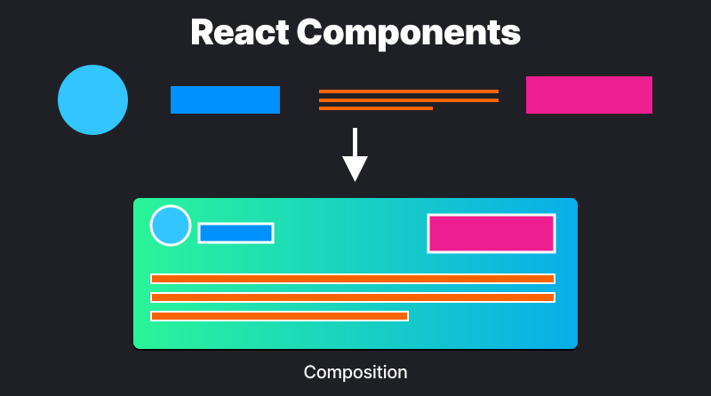

# React JS Core Concepts (Part-1):

---


#### What is React JS?

-   React JS is a JavaScript library for building user interfaces.
-   React JS is declarative, efficient and flexible.
-   It is fast and component based.
-   It was initially developed and maintained by Facebook but now its been used by millions of developer all around the globe.

#### How does React work?

-   React breaks web elements down into reusable components making it easy to manage complex web apps
-   React's Virtual DOM is a JavaScript representation of the actual DOM. When updates are made React compares the current DOM to the virtual DOM and only updates the differences between the two.

---

### `React` vs `Vue` vs `Angular`

|  Attributes   |                     React                     |                     Vue                     |                  Angular                  |
| :-----------: | :-------------------------------------------: | :-----------------------------------------: | :---------------------------------------: |
|     Type      |            Open Source JS Library             |          Progressive JS Framework           |           Javascript Framework            |
| Documentation |                   Available                   |                  Available                  |                 Available                 |
|     Size      | 109.7 KB production <br> 774.7 KB Development | 30.67 KB production <br> 279 KB Development | 167 KB production <br> 1.2 MB Development |
| Easy to learn |                   Moderate                    |                    Easy                     |         Steep (Learn Typescript)          |
| Coding Speed  |                    Normal                     |                    Fast                     |                   Slow                    |

-------
## What is React Component? 

- Building Blocks of the user interface
- Each component exists in the same place but work independently 
- Splits UI into independent and reusable pieces
- All the components are being merged in a parent component. 
- Accepts input as props and returns react element.
- Reusable having their own structure and methods.



## How to Build a Component ?  

1. Export the Function.
2. Define the Function
```js
export default function Profile(){

}
```
3. Add markup. For example: 
```js
return (

)
```

Example of a whole component:
```js
export default function Profile(){
	return (
	
	)
}
```

---

## What is JSX?

- JSX is a syntax extension for JavaScript
- JSX stands for JavaScript XML.
- Let's you write HTML like markup inside your JavaScript file.

### The Rules of JSX :
1. Returns a single root element.
2. Close all the tags
3. Must use camel case
	1. class  => className
	2. onclick => onClick
	3. tabindex => tabIndex
4. use Curly braces for JS logics inside html markup

-----

### What are Props ?

- React Components use props to communicate with each other.
- Every parent component can pass some information to its child components by giving them props.
- You can pass any JavaScript value through props, including objects, arrays and functions.

N.B : Props are Unidirectional. Data flows only from parent components to its child.

---

### What is Conditional Rendering?

![[Pasted image 20230907192532.png]]

- Conditional Rendering is the process of displaying different content based on certain conditions or states.
- It allows you to create dynamic user interfaces that can adapt to changes in data and user interactions.
- It can be done using If-else conditions or ternary operators or using logical operators( `&&` `||`  )

![[Pasted image 20230907192426.png]]
### Why conditional rendering is Necessary in React Applications?

- Improved User experience
- Improved performance 
- Simplified Code 
- Flexibility 