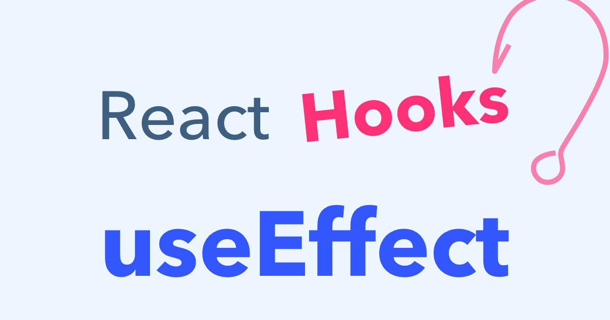
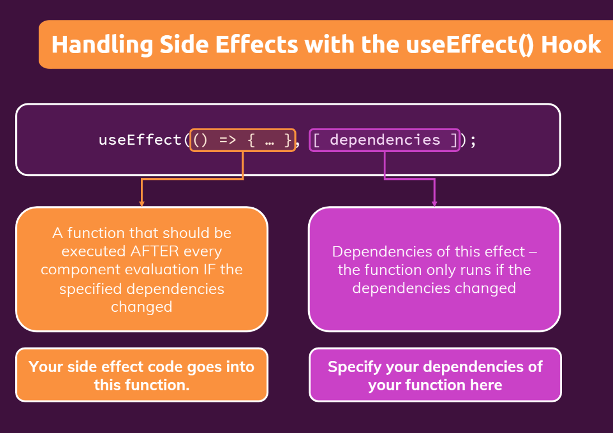

# React JS Core Concepts (Part-2):
---


### Event Handler on React JS  ➡ :

- Event Handler's are your own functions that will be triggered in response to interactions like clicking, hovering, focusing inputs etc.
- Functions passed to event handlers must be passed not called

```jsx
<button onClick={handleClick}> Click Me </button>
```

1. We can handle events by passing a function as a prop to  an element like `<button>`
2. We can define event handlers separately or inline.
3. Event handlers are defined inside a component, so they can access props.
4. You can declare an event handler in a parent and pass it as prop to a child.

---

## What are React Hooks?


=> Hooks were added to React in version 16.8.

=> Hooks allow function components to have access to state and other React features.

##### <u>There are 3 rules for hooks :</u>

- Hooks can only be called inside React function components.
- Hooks can only be called at the top level of a component.
- Hooks cannot be conditional


---
### 1. Use State Hooks:


- Components often need to change what's on the screen as a result of an interaction.
- Typing into the form should update the input field, clicking buttons should change the UI designs of the website
- Components need to remember things: the current input value, the current image, the current shopping carts. In React, this kind of component-specific-memory is called state.


---

### 2. Use Effect Hooks: 



#### What are Effects ?

=> There are two types of logic inside React components :

1. __Rendering Code :__ *Lives at the top level of your component. This is where you take the pops and state, transform them , and return the JSX you want to see on screen.*
2. __Event Handlers :__ *An event handler might update an input field, submit an HTTP POST to buy a product, or navigate the user to another screen.*

Event handlers contain "side effects" (they change the programs state) caused by a specific user action. 

#### What are Side Effects in React ? 

- Not predictable 
- Actions which are performed with the "outside world".
- A side effect is performed when we need to reach outside the scope of our current react components to do something.
- React component rendering and side effect logic are independent.

##### Some Common Side effects =>

- Making a request to an API for data from a backend server.
- To interact with browser APIs
- Using unpredictable timing functions like setTimeout() or setInterval()
- Reading data from local storage


### What is useEffect? 


##### **useEffect exists =>** 

- To synchronize a component with an external system.
- To provide a way to handle performing these side effects
- Doesnt affect the rendering or performance of the component that it's in
- Performs asynchronous tasks



#### How to write an Effect

To write an effect, follow these three steps: 

1)  Declare an Effect, you Effect will run after every render.  Then, call it at the top level of your component and put some code inside your Effect:
```jsx
import { useEffect } from 'react';

function MyComponent(){
	useEffect(() => {
	// Code will run here after every render
	})
}
```

2) Specify the Effect dependencies : Most Effects should only re-run when needed rather than after every render. For example. a fade in animation should only trigger when a component apperas.
3) Add cleanup if needed. Some Effects need to specify how to stop, undo, or clean up whatever they were doing. For example, "connect" need "disconnect"


---

> _Let's create a difference together_